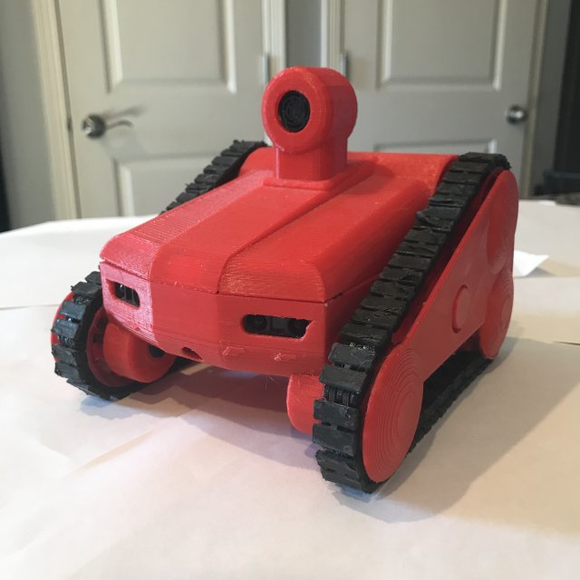
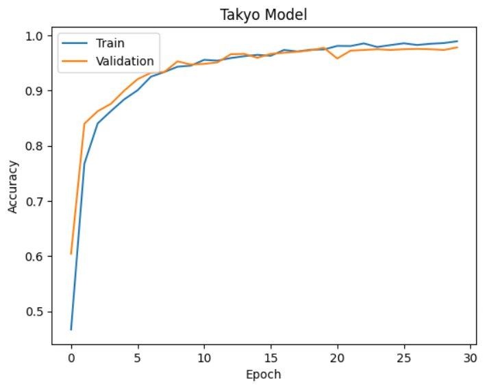
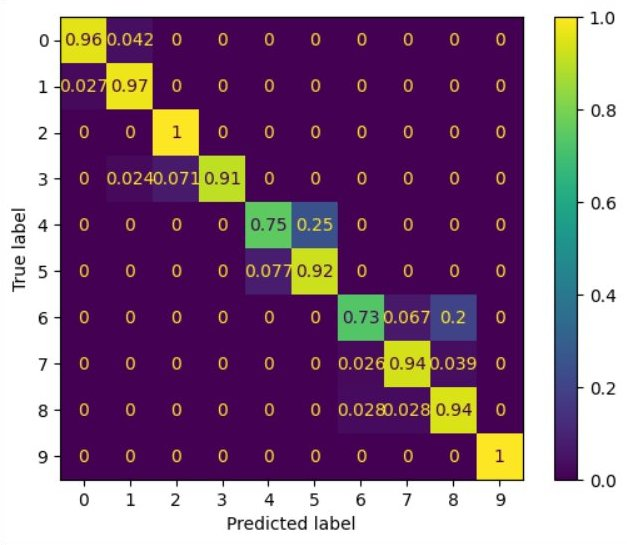

# Takyo

Takyo creates training data using programming logic statements. Output sensor data is trained and validated using Tensorflow. When the trained model is loaded back to Takyo decisions are made based on inference rather than programming logic.

## Sensors
* Ultrasonic Sensor            - MB1040
* 2 Infrared Sensors           - GP2Y0A21YK0F
* Time of Flight Sensor        - VL53L0x
* Compass / Gyro Accelerometer - LSM303
## Processors
* Arduino Nano
* Raspberry Pi Zero W 
## Data Generator
Takyo generates the following input data for Classification. (rlog1.csv)
* org     - The original sensor hit
* compss  - Current compass reading
* pitch   - Pitch
* roll    - Roll
* cliff   - Edge detection, also called Cliff, also called TOF
* lft     - Sensor value at time of hit
* ctr     - Sensor value at time of hit
* rht     - Sensor value at time of hit
* lastlft - Time since last hit (maximum 10000 ms)
* lastrht - Time since last hit
* lftavg  - Average times since last hit (mean - average of last 20 hits)
* rhtavg  - Average times since last hit (mean - average of last 20 hits)
* dturn   - Decision Turn delay - this column is dropped 
* ddir    - Decision Turn Type (ddir is what we are trying to predict)
## Predictions and Model
A classification network is configured to determine which way the robot should turn. rlog1.csv is used for training, and validation. The output is a classification of Turn Type. Listed below:
* 0LF - left turn  
* 0RT - right turn  
* 1LF - left turn last hit time used for decision
* 1RT - right turn 
* CLF - left turn after "Clear to Go"
* CCT - go forward (no turn) after "Clear to go"
* CRT - right turn 
* ALF - left turn averages were used for decision
* ART - right turn  
* SLF - left turn random arc - this is the absolute fall back when no decision can be made
* SRT - right turn random arc
* FWD - decision to go straight forward

"Clear to Go" or "CTG" is an event that happens when no sensors are hit for some period of time 10-20 seconds. This can also be considered a "reward" in training, or good behaviour.

## Observations
Actual predictions ranged from 92-98% in 30-50 epochs. The model may be overfitting too early. More data would improve accuracy. Though I tried to predict dturn or "turn delay time" using regression, it failed. A more complete model would predict both the direction to turn and the turn arc in degrees.

Compass headings are inaccurate indoors. Mapping is possible outdoors where the compass works normally. 

## Video
[Takyo on Youtube](https://www.youtube.com/watch?v=0TxFcdLs24w)

## Reference
READ THE NOTEBOOK! Takyo_classification.ipynb Jupyter notebook was used for Classification and contains the testing results. This is a read only notebook.

## Training Snapshot

## Confusion Matrix

## Conclusion
"Shadowing" robotics can be done on a small scale. Computer logic can be replaced by an AI model.

When the AI model is loaded on a subsequent machine there would be no need for programming logic.
Classification outputs are tied directly to motor actions. The machine is thinking, through inference.

